# 计算机系统基础笔记

* [计算机系统基础笔记](#计算机系统基础笔记)
  * [简介](#简介)
  * [chapter02 数据的机器级表示与处理](#chapter02-数据的机器级表示与处理)
    * [0x00 数值概念](#0x00-数值概念)
    * [0x01 补码表示](#0x01-补码表示)
    * [0x02 浮点数表示](#0x02-浮点数表示)
    * [0x03 整数运算](#0x03-整数运算)
    * [0x04 浮点数运算](#0x04-浮点数运算)
  * [chapter03 程序的转换及机器级表示](#chapter03-程序的转换及机器级表示)
  * [chapter04 程序的链接](#chapter04-程序的链接)
    * [0x00 概述](#0x00-概述)
    * [0x01 文件分类](#0x01-文件分类)
    * [0x02 符号&amp;符号表](#0x02-符号符号表)
    * [0x03 链接](#0x03-链接)
    * [0x04 可执行文件加载](#0x04-可执行文件加载)
    * [0x05 动态链接](#0x05-动态链接)
  * [chapter05 程序的执行](#chapter05-程序的执行)
    * [0x01 CPU执行指令过程概述](#0x01-cpu执行指令过程概述)
  * [chapter06 层次结构存储系统](#chapter06-层次结构存储系统)
    * [0x01 高速缓存](#0x01-高速缓存)
    * [0x02 虚拟存储器](#0x02-虚拟存储器)
    * [0x03 IA\-32/Linux中的地址转换](#0x03-ia-32linux中的地址转换)
  * [chapter07 异常控制流](#chapter07-异常控制流)
    * [0x01 进程与进程的上下文切换](#0x01-进程与进程的上下文切换)
    * [0x02 异常和中断](#0x02-异常和中断)
    * [0x03 IA\-32的向量中断方式](#0x03-ia-32的向量中断方式)
  * [chapter08 IO操作的实现](#chapter08-io操作的实现)

## 简介

- 学习南大计算机系统基础慕课的笔记，大部分来自PPT的整理，仅供参考:)
- 知识固然重要，Lab同样不能错过:)

## chapter02 数据的机器级表示与处理

### 0x00 数值概念

- 机器级数据分类
  - 数值数据：无符号整数、带符号整数、浮点数（实数）
  - 非数值数据：逻辑数（包括位串）、西文字符和汉字
- 真值和机器数
  - 机器数：用0和1编码的计算机内部的0/1序列
  - 真值：带正负号的十进制数
- 数值表示三要素
  - 进位计数制
    - 10、2、8、16进制
  - 定、浮点表示
    - 定点整数、定点小数
    - 浮点数
  - 二进制编码
    - 原码、补码、反码、移码
- 定点数&浮点数
  - 小数点位置约定在固定位置的数称为定点数；小数点位置约定为可浮动的数称为浮点数
  - 定点小数用来表示浮点数的尾数部分，定点整数用来表示整数，分带符号整数和无符号整数

### 0x01 补码表示

- 补码(模运算)
  - 补码为n位，定义：[X]补=(2^n) + X，-2^(n-1) ≤ X ＜2^(n-1)，一个负数的补码等于模减该负数的绝对值
  - 加减法统一，克服了原码的缺点
  - 减法本质：对于某一确定的模，某数减去小于模的另一数，可以用该数加上另一数负数的补码来代替
  - 一个负数的补码等于将对应正数补码，各位取反、末位加一(简便计算方法：负数的绝对值从右往左数，第一个出现的1左边的位全部取反)，eg：[-7]补=[-0111]补=[1001]
  - 一个负数补码的真值等于数值各位取反，末位加一(数值部分从右往左数，第一个出现的1左边的位全部取反)
- 变形补码
  - 双符号，用于存放可能溢出的中间结果
  - 其他与补码相同


- 移码

  - 定义：将每一个数值加上一个偏置常数
  - 用来表示浮点数的阶码，避免对阶过程中出现负数大于正数的情况，如-1(111)  >  3(011)

- 机器中字的位排列顺序

  - 大端：0x12345678在内存中低地址到高地址的存储方式：12 34 56 78
  - 小端：0x12345678在内存中低地址到高地址的存储方式：78 56 34 12

- C语言中的整数

  - 若同时有无符号和带符号整数，则C编译器将带符号整数强制转换为无符号数

    - 数据类型的表示范围

    |          关系表达式           |  类型  | 结果 |
    | :---------------------------: | :----: | :--: |
    |           0 = = 0U            | 无符号 |  1   |
    |            -1 < 0             | 有符号 |  1   |
    |            -1 < 0U            | 无符号 |  0   |
    | 2147483647 > -2147483647 - 1  | 有符号 |  1   |
    | 2147483647U > -2147483647 - 1 | 无符号 |  0   |
    | 2147483647 > (int) 2147483648 | 有符号 |  1   |
    |            -1 > -2            | 有符号 |  1   |
    |      (unsigned) -1 > -2       | 无符号 |  1   |

  - 编译器差别

    

    - C90出现的问题：（1）-2147483648 > 2147483647 （2）-2147483648-1 = 2147483647

### 0x02 浮点数表示

- 浮点数表示

  			

  - | S（0-1） | 阶码E（2-8） | 尾数M（9-31） |
    | :------: | :----------: | :-----------: |

    第0位数符S；第1～8位为8位移码表示阶码E（偏置常数为128）；第9～31位为24位二进制原码小数表示的尾数M。规格化尾数的小数点后第一位总是1，故规定第一位默认的“1”不明显表示出来。这样可用23个数位表示24位尾数；最大正数：0.11…1 x 2^

    (11…1)=(1-2^-24) x 2^127，最小负数：0.10…0 x 2^(00…0) = (1/2) x 2^(-128)

    

  - 规格化表示：规格化数的小数点前为1

  - IEEE 754 标准

    - | S(1 bit) | Exponent(8 bit) | Significand(23 bit) |
      | :------: | :-------------: | :-----------------: |

    - 阶码全0和全1表示特殊值，规格化阶码的范围为0000 0001 (-126) ~ 1111 1110 (127)

    - (SP)单精度的偏置常数为127，(DP)双精度的偏置常数为1023

    - SP: (-1)^S x (1 + Significand) x 2^(Exponent-127)； DP：(-1)^S x (1 + Significand) x 2^(Exponent-1023)

  - 特殊形式的浮点数

    - +0、-0：除了符号为1或0，阶码与尾数部分全为0                                                                                                                          +0: 0 00000000 00000000000000000000000，-0: 1 00000000 00000000000000000000000
    - +∞、-∞：符号为0或1，阶码部分全为1，尾数部分全为0，                                                                                                             +∞ : 0 11111111 00000000000000000000000，-∞: 1 11111111 00000000000000000000000
    - NaN(非数)(辅助调试程序)：阶码全为1，尾数部分不全为0

### 0x03 整数运算

- 加减运算

  - [A+B]补=A + B + 2^ n=A + 2^n + B + 2^n=[A]补+[B]补，[A-B]补=[A]补+[B]补

  - 标志计算：OF=Cn-1异或Cn（C代表进位），CF=Cout异或Cin

  - 无符号加溢出条件：CF=1，带符号加溢出条件：OF=1

  - 无符号减溢出条件：CF=1，带符号减溢出条件：OF=1

  - 减法比较大小规律：（1）无符号：CF=0时，大于；（2）OF=SF时，大于

  - 无符号数加溢出判断：

    ```c
    int uadd_ok(unsigned x, unsigned y)
    {
        unsigned ret = x + y;
        return ret >= x;
    }
    ```

  - 带符号数加溢出判断：

    ```c
    int tadd_ok(int x, int y)
    {
        int ret = x + y;
        if(x >= 0 && y >= 0 && ret < 0)
            return 0;
        else if(x < 0 && y < 0 && ret >= 0)
            return 0;
        else
            return 1;
    }
    ```

  - 带符号数减溢出判断：

    ```c
    int tsub_ok(int x, int y) 
    {
        if(!x && y == 0x80000000)
            return 0;
        else
            return tadd_ok(x, -y); 
    }
    ```

- 乘除运算

  - 乘法运算

    - 若x为浮点数，x^2>=0;若x为带符号整数， x^2不一定>=0

    - 带符号乘积结果正确的情况：高n+1位全0或1；无符号乘积结果正确的情况：高n位全0

    - 程序可以自行加判断
  
    ```c
    int mul(int x, int y)
    { 
        int z=x*y;
        if(!x || z / x == y)
            return z;
        else
            return 0;
    }
    ```

    - 溢出漏洞
  
    ```c
    int copy_array(int *array, int count) { 
        int i; 
        /* 在堆区申请一块内存 */
        int *myarray = (int *) malloc(count*sizeof(int)); 
        if (myarray == NULL) 
            return -1;
        for (i = 0; i < count; i++) 
            myarray[i] = array[i]; 
        return count; 
    } 
    ```
  
    malloc的参数为无符号类型，发生溢出后进行模运算，得到较小的值，申请到一个小内存，却可以向堆区写入大量数据
    
  - 除法运算
  
    - 无法表示的特殊情况(发生溢出)：-2^(n-1)/-1 = 2^(n-1)
    - 整数除法，当除数为0时，发生异常
    - 不能整除时，采用朝零舍入，eg: 7/2=3, -7/2=-3
    - 优化产生的差异
  
    正常情况：
  
    ```c
    int a = 0x80000000;
    int b = a / -1; 
    printf("%d\n", b);
    // 运行结果为-2147483648
    // 除以-1被优化成取负指令neg，补码不变
    ```
  
    异常情况：
  
    ```c
    int a = 0x80000000;
    int b = -1;
    int c = a / b; 
    printf("%d\n", c);
    // 运行结果为“Floating point exception”
    ```
  
    - 右移运算的除法
  
    无符号整数：直接右移得到结果
  
    带符号负整数：加偏移量2^k-1，再右移k位
  
    编程实现案例（除以32）：
  
    ```c
    int div32(int x)
    {
        int b = x >> 31 & 0x1f;
        return (x + b) >> 5;
    }
    ```

### 0x04 浮点数运算

- 运算规则

  设两个规格化浮点数分别为 A=Ma×2^(Ea) ，B=Mb×2^(Eb)

  A+B=(Ma+Mb×2^-(Ea-Eb)) × 2^Ea

  A+B=(Ma-Mb×2^-(Ea-Eb)) × 2^Ea

  A*B=(Ma\*Mb)×2^(Ea+Eb)

  A/B=(Ma/Mb)×2^(Ea-Eb)

- IEEE 754规定异常情况

  - 无效运算：运算时有一个数是非有限数；结果无效
  - 除以0
  - 阶码上溢(如SP时，阶码>11111110)
  - 阶码下溢(如SP时，阶码<00000001)
  - 结果不准确，发生舍入

- 精度问题

  - IEEE754规定: 中间结果须在右边加2个附加位 （guard & round）；Guard (保护位)：在significand右边的位，Round (舍入位)：在保护位右边的位；就近舍入：01：舍，11：入，10：(强迫结果为偶数)

  ```
  int x ;
  float f ;
  double d ;
  
  //判断是否永真
  x == (int)(float)x	
  false
  x == (int)(double)x	
  true
  f == (float)(double)f	
  true
  d == (float)d	
  false
  f == -(-f)	
  true
  2/3 == 2/3.0	
  false
  d < 0.0推导((d*2) < 0.0)	
  true
  d > f推导-f > -d	
  true
  d * d >= 0.0	
  true
  x*x>=0	
  false
  (d+f)-d == f	
  false,若f太小，d+f=d
  ```

## chapter03 程序的转换及机器级表示

## chapter04 程序的链接

### 0x00 概述

- 程序转换处理过程

  - 预处理(cpp程序处理得到.i文本文件)
  - 编译(cc1处理得到.s汇编文件)
  - 汇编(as程序处理得到.o可重定位文件)
  - 链接(ld程序处理得到可执行文件)

  

### 0x01 文件分类

- 目标文件

  Windows： PE格式；

  Linux等类UNIX： ELF格式

  - 可重定位目标文件(.o/.obj)

    - 文件格式

    

    

    - ELF头

    定义了ELF魔数、版本、小端/大端、操作系统平台、目标文件的类型、机器结构类型、程序执行的入口地址、程序头表（段头表）的起始位置和长度、节头表的起始位置和长度等

    ```c
    #define EI_NIDENT 16
    typedef struct {
        unsigned char e_ident[EI_NIDENT];   //魔数 
        Elf32_Half e_type;                  //文件类型
        Elf32_Half e_machine;               //机器架构
        Elf32_Word e_version;               //版本
        Elf32_Addr e_entry;                 //程序执行的入口地址，即执行程序时第一条指令的地址
        Elf32_Off e_phoff;                  //程序头表偏移
        Elf32_Off e_shoff;                  //节头表偏移
        Elf32_Word e_flags;
        Elf32_Half e_ehsize;                //ELF头大小
        Elf32_Half e_phentsize;             //单个程序头表目录项大小
        Elf32_Half e_phnum;                 //程序头表目录项个数
        Elf32_Half e_shentsize;             //单个节表目录项大小
        Elf32_Half e_shnum;					//节表目录项个数
        Elf32_Half e_shstrndx;              //.strtab在节表中的索引
    } Elf32_Ehdr;
    ```

    - 节头表

    ```c
    typedef struct {
        Elf32_Word sh_name;	//节名字符串在.strtab中的偏移
        Elf32_Word sh_type;	//节类型：无效/代码或数据/符号/字符串/…
        Elf32_Word sh_flags;//节标志：该节在虚拟空间中的访问属性
        Elf32_Addr sh_addr;	//虚拟地址：若可被加载，则对应虚拟地址
        Elf32_Off sh_offset;//在文件中的偏移地址，对.bss节而言则无意义
        Elf32_Word sh_size;	//节在文件中所占的长度
        Elf32_Word sh_link;	//sh_link和sh_info用于与链接相关的节（如.rel.text节、.rel.data节、.symtab节等）
        Elf32_Word sh_info;
        Elf32_Word sh_addralign;//节的对齐要求
        Elf32_Word sh_entsize;  //节中每个表项的长度，0表示无固定长度表项
    } Elf32_Shdr;
    ```

  - 可执行目标文件(默认为a.out)

    - 文件格式

    

    - 磁盘文件到内存的映射关系

    

    - 程序头表（segment header table）：指导相同属性的节在内存中合并成段

    ```c
    typedef struct {
        Elf32_Word p_type;	//类型
        Elf32_Off p_offset;	//文件偏移
        Elf32_Addr p_vaddr;	//虚拟地址
        Elf32_Addr p_paddr;	//物理地址
        Elf32_Word p_filesz;//文件大小
        Elf32_Word p_memsz;	//内存大小
        Elf32_Word p_flags;	//权限
        Elf32_Word p_align;	//对齐大小
    } Elf32_Phdr;
    
    ```

  - 共享的目标文件(.so)

    - 静态链接库(.a)

      - 将所有相关的目标模块（.o）打包为一个单独的库文件（.a），称为静态库文件 ，也称存档文件（archive）
      - 使用静态库，可增强链接器功能，使其能通过查找一个或多个库文件中定义的符号来解析符号
      - 在构建可执行文件时，只需指定库文件名，链接器会自动到库中寻找那些应用程序用到的目标模块，并且只把用到的模块从库中拷贝出来
      - 创建过程

      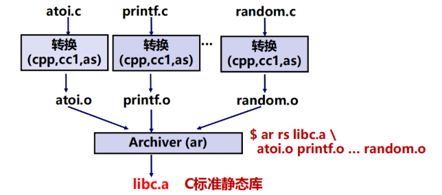

    - 动态链接库

      - 链接方式
        - 在第一次加载并运行时进行
          - Linux通常由动态链接器(ld-linux.so)自动处理
          - 标准C库 (libc.so) 通常按这种方式动态被链接
        - 在已经开始运行后进行
          - 在Linux中，通过调用 dlopen()等接口来实现
      - 创建过程

      

### 0x02 符号&符号表

- 符号

  - 符号定义

  > 局部变量是存放在栈上的，故不包含在内

  ```c
  int a = 12;
  int sum(int a, int b)
  {
  	return a + b;
  }
  ```

  - 符号引用

  ```c
  a = 1;
  sum(1, 2);
  ```

  - 符号类型

    - Global symbols（模块内部定义的全局符号）

    由模块m定义并能被其他模块引用的符号。例如，非static C函数和非static的C全局变量（指不带static的全局变量）

    - External symbols（外部定义的全局符号）

    由其他模块定义并被模块m引用的全局符号

    - Local symbols（本模块的局部符号）

    仅由模块m定义和引用的本地符号。例如，在模块m中定义的带static的C函数和全局变量

  - 强弱全局符号

    - 函数名和已初始化的全局变量名是强符号
    - 未初始化的全局变量名是弱符号

  - 符号解析规则

    - 强符号不能多次定义
    - 若一个符号被定义为一次强符号和多次弱符号，则按强定义为准
    - 若有多个弱符号定义，则任选其中一个

    例子：

    ```c
    /*main.c*/
    #include <stdio.h>
    int d=100;
    int x=200;
    void p1(void);
    int main() 
    { 
        p1();
        printf(“d=%d,x=%d\n”,d,x);
        return 0;
    }
    
    /*fun.c*/
    double d;
    
    void p1()
    {
        d = 1.0;//FLD1 -> FSTPl &d
    }
    ```

    main.c调用p1函数，d在fun模块是double类型，属于弱符号，存放在main模块的d的内存空间，执行d=1.0时，会将1.0的机器数压入浮点寄存器ST(0)（硬堆栈，80位宽），再弹出到main模块的d的内存空间，1.0的十六进制表示为：3FF0 0000 0000 0000H，这样main模块的d，x内存区域被这个十六进制数覆盖，所以d=0,x=1 072 693 248

    

- 符号表

  .symtab 节记录符号表信息，是一个结构数组，表项结构如下：

  ```c
  typedef struct {
      Elf32_Word st_name;	/*符号对应字符串在strtab节中的偏移量*/
      Elf32_Addr st_value;/*在对应节中的偏移量，或虚拟地址*/
      Elf32_Word st_size;	/*符号对应目标字节数，即函数大小或变量长度*/
      unsigned char st_info; /*指出符号的类型(Type)和绑定属性(Bind) */
      unsigned char st_other; 
      Elf32_Half st_shndx;/*符号对应目标所在的节，或其他情况*/
  } Elf32_Sym;
  
  ```

  符号类型（Type）：数据、函数、源文件、节、未知

  绑定属性（Bind）：全局符号、局部符号、弱符号

  其他情况：ABS表示不该被重定位；UND表示未定义；COM表示未初始化数据（.bss），此时，st_value表示对齐要求，st_size给出最小大小

### 0x03 链接

- 链接概述
  - 符号解析
    - 程序中有定义和引用的符号 (包括变量和函数等)
    - 编译器将定义的符号存放在一个符号表（ symbol table，结构数组）中
    - 链接器将每个符号的引用都与一个确定的符号定义建立关联
  - 重定位
    - 将多个代码段与数据段分别合并为一个单独的代码段和数据段
    - 计算每个定义的符号在虚拟地址空间中的绝对地址
    - 将可执行文件中符号引用处的地址修改为重定位后的地址信息

- 符号解析

E 将被合并以组成可执行文件的所有目标文件集合
U 当前所有未解析的引用符号的集合
D 当前所有定义符号的集合

解析过程：按顺序扫描可重定位目标文件，将定义的符号加入D，未定义的符号加入E，若一开始U为空，则可重定位文件会被丢弃。当找到U中符号的定义时，将其移除U，加入D，扫描完成时，若U为空，则符号解析成功，否则符号解析出错。符号解析的正确结果是得到E、D、空的U

总结步骤：

1. 按照命令行给出的顺序扫描.o 和.a 文件
2. 扫描期间将当前未解析的引用记录到一个列表U中
3. 每遇到一个新的.o 或 .a 中的模块，都试图用其来解析U中的符号
4. 如果扫描到最后，U中还有未被解析的符号，则发生错误

- 符号重定位

  - 合并相同的节
    - 将集合E的所有目标模块中相同的节合并成新节
  - 对定义符号进行重定位（确定地址）
    - 确定新节中所有定义符号在虚拟地址空间中的地址
    - 完成这一步后，每条指令和每个全局或局部变量都可确定地址
  - 对引用符号进行重定位（确定地址）
    - 修改.text节和.data节中对每个符号的引用（地址）,需要用到在.rel_data和.rel_text节中保存的重定位信息

  重定位条目：

  ```
  typedef struct {
      int offset;    /*节内偏移*/
      int symbol:24, /*所绑定符号*/
      type: 8;       /*重定位类型*/
  } Elf32_Rel;
  ```

IA-32两种最基本的重定位类型：

R_386_32: 绝对地址
  R_386_PC32: PC相对地址

函数引用重定位(R_386_PC32)：


### 0x04 可执行文件加载

- 加载执行流程

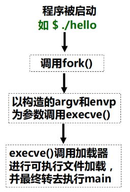

### 0x05 动态链接

- 加载时动态链接

> 在最后生成可执行文件时还是会进行部分的静态链接

加载器加载可执行文件时发现在其程序头表中有 .interp 段，其中包含了动态链接器路径名 ld-linux.so，因而加载器根据指定路径加载并启动动态链接器运行，动态链接器完成相应的重定位工作，再开始执行相应的指令

- 位置无关代码

要实现动态链接，必须生成PIC代码，链接器无需修改代码即可将共享库加载到任意地址运行

所有引用情况：


## chapter05 程序的执行

### 0x01 CPU执行指令过程概述

- CPU执行指令过程概述

  - 取指令：从PC所指单元取出指令送指令寄存器（IR），并增量PC
  - 指令译码：不同指令其功能不同，因而需要不同的操作控制信号
  - 源操作数地址计算并取操作数：根据寻址方式确定源操作数地址计算方式
  - 执行数据操作：在ALU或加法器等运算部件中对取出的源操作数进行运算
  - 目的操作数地址计算并存结果：根据寻址方式确定目的操作数地址计算方式
  - 指令地址计算并将其送PC：顺序执行时，PC加上当前指令长度；遇到转移类指令时，则需要根据条件码、操作码和寻址方式等确定下条指令地址

  

  

## chapter06 层次结构存储系统

### 0x01 高速缓存

- 计算机存储器的层次结构示意图：

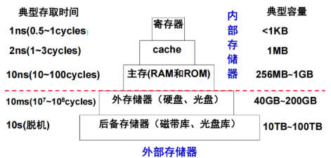

- 时间局部性&空间局部性

  - 时间局部性：刚被访问过的单元很可能不久又被访问
  - 空间局部性：刚被访问过的单元的邻近单元很可能不久被访问
  - 编写局部性良好的程序能提高程序的执行效率，一般来说按照`顺序存储、顺序访问`的原则

  ```c
  //程序段A:
  int sumarrayrows(int a[M][N])
  {
      int i, j, sum=0;
      for (i=0; i<M, i++)
      for (j=0; j<N, j++) sum+=a[i][j];
      return sum;
  }
  
  //程序段B:
  int sumarraycols(int a[M][N])
  {
      int i, j, sum=0;
      for (j=0; j<N, j++)
      for (i=0; i<M, i++) sum+=a[i][j];
      return sum;
  }
  
  //程序A：59,393,288 时钟周期
  //程序B：1,277,877,876 时钟周期
  ```

- Cache

  - 访问地址单元的内容的过程示意图：

  

  - Cache三种映射方式

    - 直接映射：每个主存块映射到Cache的固定行

    

    - 全相联映射：每个主存块映射到Cache的任一行

    

    - 组相联映射：每个主存块映射到Cache固定组中任一行

    

  - Cache替换算法

    - `先进先出FIFO` （first-in-first-out）
      - 总是把最先进入的那一块淘汰掉
      - 非栈算法，命中率并不随组的增大而提高
    - `最近最少用LRU` （ least-recently used）
      - 每个cache行设定一个计数器(LRU位)，根据计数值来记录这些主存块的使用情况
      - 栈算法，命中率随组的增大而提高
    - `最不经常用LFU `（ least-frequently used）
      - 原理类似LRU
    - `随机替换算法`（Random）
      - 略
  
  - Cache写策略
  
    - 写命中（Write Hit）：要写的单元已经在Cache中
      - `Write Through` (通过式写、写直达、直写)
        - 同时写Cache和主存单元，效率较低
      - `Write Back` (一次性写、写回、回写)
        - 只写cache不写主存，缺失时一次写回，每行有个修改位（dirty bit-脏位），大大降低主存带宽需求，控制可能很复杂
    - 写不命中（Write Miss）：要写的单元不在Cache中
      - `Write Allocate` (写分配)
        - 将主存块装入Cache，然后更新相应单元
        - 试图利用空间局部性，但每次都要从主存读一个块
      - `Not Write Allocate` (非写分配)
        - 直接写主存单元，不把主存块装入到Cache

### 0x02 虚拟存储器

- 分页式

  - 基本思想：内存被分成固定长且比较小的存储块（页框、实页、物理页），每个进程也被划分成固定长的程序块（页、虚页、逻辑页），无需用连续页框来存放一个进程，操作系统为每个进程生成一个页表，通过页表(page table)实现逻辑地址向物理地址转换（Address Mapping）

  - 逻辑地址（Logical Address）：程序中指令所用地址(进程所在地址空间)，也称为虚拟地址（Virtual Address，简称VA）

  - 物理地址（Physical Address，简称PA）：存放指令或数据的实际内存地址，也称为实地址、主存地址

  - 具体操作：

    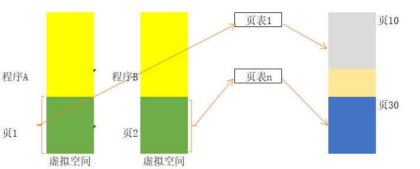

  - 内存中的页表：每个进程有一个页表，其中有装入位、修改（Dirt）位、替换控制位、访问权限位、禁止缓存位、实页号

    - 未分配页：进程的虚拟地址空间中“空洞”对应的页

    - 已分配的缓存页：有内容对应的已装入主存的页

    - 已分配的未缓存页：有内容对应但未装入主存的页

    - 页表结构图：

      

  - Cache中的页表(Translation Lookaside Buffer or `TLB`)：加快访问速度

    - TLB结构图：

      

    - TLB全相联时，没有index，只有Tag，虚页号需与每个Tag比较；TLB组相联时，则虚页号高位为Tag，低位为index，用作组索引

- 分段式

  - 将程序模块或数据模块分配给不同的主存段，一个大程序有多个代码段和多个数据段构成，是按照程序的逻辑结构划分而成的多个相对独立的部分

  - 避免出现一个内存块被分割到不同页的情况

  - 具体操作：

    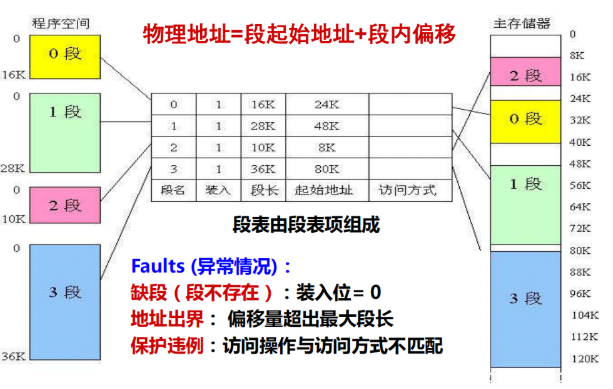

- 段页式

  - 程序的虚拟地址空间按模块分段、段内再分页，进入主存仍以页为基本单位
  - 根据段地址到段表中查阅与该段相应的页表首地址，转向页表，然后根据页地址从页表中查到该页在主存中的页框地址，由此再访问到页内某数据

### 0x03 IA-32/Linux中的地址转换

- 逻辑地址转换为线性地址、

  - 寻址示意图：

    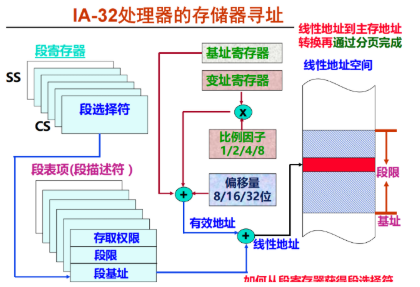

  - 段选择符&段寄存器

    - 段寄存器（16位），用于存放段选择符

      - CS(代码段)：程序代码所在段
      - SS(栈段)：栈区所在段
      - DS(数据段)：全局静态数据区所在段
      - 其他3个段寄存器ES、GS和FS可指向任意数据段

    - 段选择符

      - 示意图：

        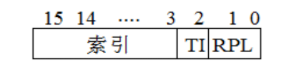

      - TI=0，选择全局描述符表(GDT)，TI=1，选择局部描述符表(LDT)；RPL=00，为第0级，位于最高级的内核态，RPL=11，为第3级，位于最低级的用户态，第0级高于第3级；高13位索引用来确定当前使用的段描述符在描述表中的位置

  - 段描述符

    - 结构示意图：

      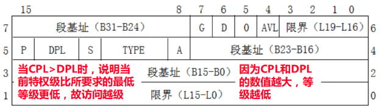

      B31-B0： 32位基地址； L19-L0： 20位限界，表示段中最大页号；G：粒度，G=1以页（4KB）为单位；G=0以字节为单位。因为界限为20位，故当G=0时最大的段为1MB；当G=1时，最大段为4KB×220 =4GB；P： P=1表示存在，P=0表示不存在。Linux总把P置1，不会以段为单位淘汰；DPL：访问段时对当前特权级的最低等级要求；S： S=0系统控制描述符，S=1普通的代码段或数据段描述符；A： A=1已被访问过，A=0未被访问过

- 线性地址转换为物理地址

  - 二级页表

    - 4GB内存虚拟地址空间有2^20个页表，页表大小为4MB，故需要对页表进行分页，页表的页表个数为1K，页表的页表称为页表目录，页表目录大小为4KB

      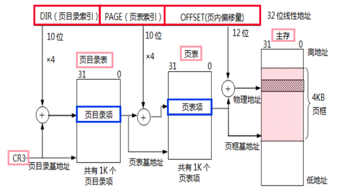

    - 页目录项和页表项

      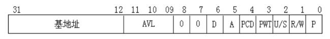

## chapter07 异常控制流

### 0x01 进程与进程的上下文切换

- 异常控制流：由于某些特殊情况引起用户程序的正常执行被打断所形成的意外控制流

- 异常控制流的形成原因：

  - 硬件层
    - 内部异常（缺页、越权、越级、整除0、溢出等）
    - 外部中断（Ctrl-C、打印缺纸、DMA结束等）
  - 软件层
    - 进程的上下文切换(操作系统层)
    - 一个进程直接发送信号给另一个进程(应用软件层)

- 进程存储器映射图：

  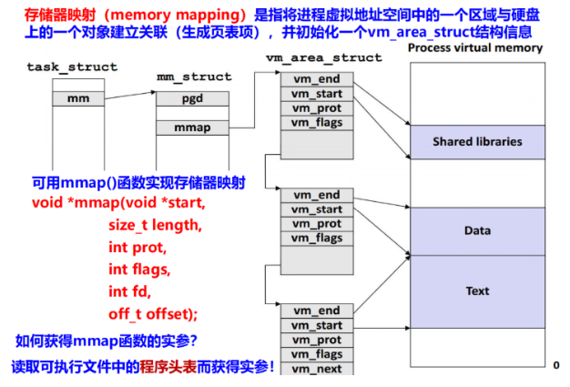

- 进程地址空间分布图：

  

- 进程的上下文切换：OS通过处理器调度让处理器轮流执行多个进程。实现不同进程中指令交替执行的机制

### 0x02 异常和中断

- 异常
  - 分类
    - 故障(fault) ：执行指令引起的异常事件，如溢出、非法指令、缺页、访问越权等。“断点”为发生故障指令的地址
    - 自陷(Trap) ：预先安排的事件（“埋地雷”），如单步跟踪、断点、系统调用 (执行访管指令) 等。是一种自愿中断。“断点”为自陷指令下条指令地址
    - 终止(Abort) ：硬故障事件，此时机器将“终止”，调出中断服务程序来重启操作系统
    - 中断(interrupt)：外设通过中断请求信号线向CPU提出“中断”请求，不由指令引起，属于异步
  - 故障举例：页故障
    - 缺页：页表项有效位为0
    - 地址越界：地址大于最大界限
    - 访问越级或越权（保护违例）
      - 越级：用户进程访问内核数据（CPL=3 / DPL=0）
      - 越权：读写权限不相符
  - 陷阱
    - 系统调用：通过特定的系统调用号进行相应的陷阱处理
    - 单步跟踪：IF=1&&TF=1
  - 中断
    - 事件：Ctrl-C、DMA传送结束、网络数据到达、打印缺纸、……
    - 每执行完一条指令，CPU就查看中断请求引脚，若引脚的信号有效，则进行中断响应：将当前PC（断点）和当前机器状态保存到栈中，并“关中断”，然后从数据总线读取中断类型号，根据中断类型号跳转到对应的中断服务程序执行
  - 响应过程
    - 关中断（“中断允许位” 清0）：使CPU处于“禁止中断”状态，以防止新中断破坏断点（PC）、程序状态（PSW）和现场（通用寄存器）
    - 保护断点和程序状态：将断点和程序状态保存到栈或特殊寄存器中
    - 识别中断事件：有软件识别和硬件识别（向量中断）两种不同的方式
      - 软件识别（MIPS采用）
        - 设置一个异常状态寄存器（MIPS中为Cause寄存器），用于记录异常原因。操作系统使用一个统一的异常处理程序，该程序按优先级顺序查询异常状态寄存器，识别出异常事件
      - 硬件识别（向量中断）（IA-32采用）
        - 用专门的硬件查询电路按优先级顺序识别异常，得到“中断类型号”，根据此号，到中断向量表中读取对应的中断服务程序的入口地址

### 0x03 IA-32的向量中断方式

256种不同类型的异常和中断，每个异常和中断都有唯一编号，称之为中断类型号（也称向量号），每个异常和中断有与其对应的异常处理程序或中断服务程序，其入口地址放在一个专门的中断向量表或中断描述符表中，实模式下，用中断向量表描述；保护模式下，用中断描述符表描述。通过执行INT n（指令第二字节给出中断类型号n，n=32~255），使CPU自动转到OS给出的中断服务程序执行

- IA-32的中断类型

  - 用户自定义类型号为32~255，部分用于可屏蔽中断，部分用于软中断
  - 可屏蔽中断通过CPU的INTR 引脚向CPU发出中断请求
  - 软中断指令 INT n 被设定为一种陷阱异常，例如，Linux通过int 0x80指令将128号设定为系统调用，而Windows通过int  0x2e指令将46号设定为系统调用

- 中断描述符表

  - 中断描述符表（IDT）是OS内核中的一个表，共有256个表项，每个表项占8个字节，IDT共占用2KB
  - IDTR中存放 IDT在内存的首地址
  - 每一个表项是一个中断门描述符、陷阱门描述符或任务门描述符

  

## chapter08 IO操作的实现

