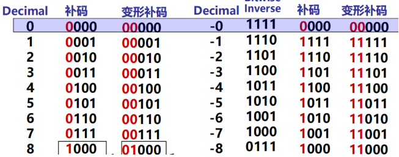

# 计算机系统基础笔记

## chapter01 数制与编码

- 机器级数据分类
  - 数值数据：无符号整数、带符号整数、浮点数（实数）
  - 非数值数据：逻辑数（包括位串）、西文字符和汉字
- 真值和机器数
  - 机器数：用0和1编码的计算机内部的0/1序列
  - 真值：带正负号的十进制数
- 数值表示三要素
  - 进位计数制
    - 10、2、8、16进制
  - 定、浮点表示
    - 定点整数、定点小数
    - 浮点数
  - 二进制编码
    - 原码、补码、反码、移码
- 定点数&浮点数
  - 小数点位置约定在固定位置的数称为定点数；小数点位置约定为可浮动的数称为浮点数
  - 定点小数用来表示浮点数的尾数部分，定点整数用来表示整数，分带符号整数和无符号整数

- 补码(模运算)
  - 补码为n位，定义：[X]补=(2^n) + X，-2^(n-1) ≤ X ＜2^(n-1)，一个负数的补码等于模减该负数的绝对值
  - 加减法统一，克服了原码的缺点
  - 减法本质：对于某一确定的模，某数减去小于模的另一数，可以用该数加上另一数负数的补码来代替
  - 一个负数的补码等于将对应正数补码，各位取反、末位加一(简便计算方法：负数的绝对值从右往左数，第一个出现的1左边的位全部取反)，eg：[-7]补=[-0111]补=[1001]
  - 一个负数补码的真值等于数值各位取反，末位加一(数值部分从右往左数，第一个出现的1左边的位全部取反)
- 变形补码
  - 双符号，用于存放可能溢出的中间结果
  - 其他与补码相同

- 移码

  - 定义：将每一个数值加上一个偏置常数
  - 用来表示浮点数的阶码，避免对阶过程中出现负数大于正数的情况，如-1(111)  >  3(011)

- 机器中字的位排列顺序

  - 大端：0x12345678在内存中低地址到高地址的存储方式：12 34 56 78
  - 小端：0x12345678在内存中低地址到高地址的存储方式：78 56 34 12

- C语言中的整数

  - 若同时有无符号和带符号整数，则C编译器将带符号整数强制转换为无符号数

    - 数据类型的表示范围

    |          关系表达式           |  类型  | 结果 |
    | :---------------------------: | :----: | :--: |
    |           0 = = 0U            | 无符号 |  1   |
    |            -1 < 0             | 有符号 |  1   |
    |            -1 < 0U            | 无符号 |  0   |
    | 2147483647 > -2147483647 - 1  | 有符号 |  1   |
    | 2147483647U > -2147483647 - 1 | 无符号 |  0   |
    | 2147483647 > (int) 2147483648 | 有符号 |  1   |
    |            -1 > -2            | 有符号 |  1   |
    |      (unsigned) -1 > -2       | 无符号 |  1   |

  - 编译器差别

    

    - C90出现的问题：（1）-2147483648 > 2147483647 （2）-2147483648-1 = 2147483647

- 浮点数表示

  			

  - | S（0-1） | 阶码E（2-8） | 尾数M（9-31） |
    | :------: | :----------: | :-----------: |

    第0位数符S；第1～8位为8位移码表示阶码E（偏置常数为128）；第9～31位为24位二进制原码小数表示的尾数M。规格化尾数的小数点后第一位总是1，故规定第一位默认的“1”不明显表示出来。这样可用23个数位表示24位尾数；最大正数：0.11…1 x 2^

    (11…1)=(1-2^-24) x 2^127，最小负数：0.10…0 x 2^(00…0) = (1/2) x 2^(-128)

    

  - 规格化表示：规格化数的小数点前为1

  - IEEE 754 标准

    - | S(1 bit) | Exponent(8 bit) | Significand(23 bit) |
      | :------: | :-------------: | :-----------------: |

    - 阶码全0和全1表示特殊值，规格化阶码的范围为0000 0001 (-126) ~ 1111 1110 (127)

    - (SP)单精度的偏置常数为127，(DP)双精度的偏置常数为1023

    - SP: (-1)^S x (1 + Significand) x 2^(Exponent-127)； DP:(-1)^S x (1 + Significand) x 2^(Exponent-1023)

  - 

