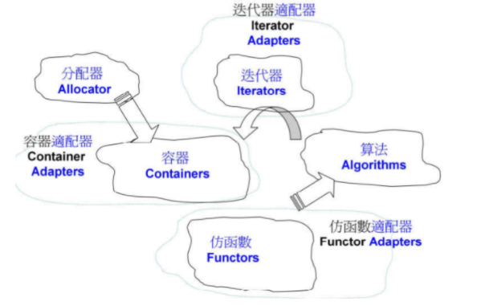
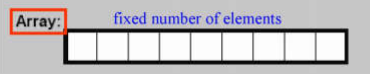
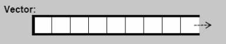
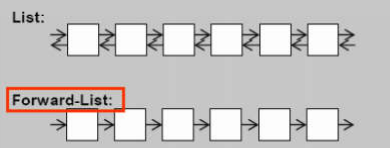
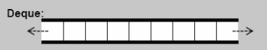
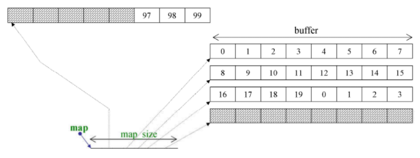
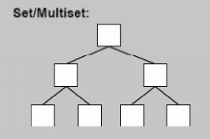
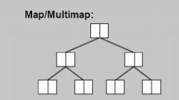
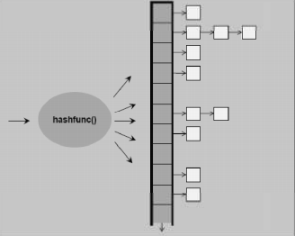

# STL（Standard Template Library）

> 源码之前，了无秘密

## 0.0 概述

> STL的核心是GP，GP体现在Template的使用上，GP将data与methods分离，然而OOP将data与methods进行封装

- STL六大组件

  书籍描述：Container通过Allocator取得数据储存空间，Algorithm通过Iterator存取Container内容，Functor可以协助Algorithm完成不同的策略变化，Adapter可以修饰或套接Functor

  大白话：容器使用一定的数据结构存放数据，分配器负责内存管理，算法通过迭代器（近似指针）访问数据进行处理，仿函数为算法提供援助，容器、迭代器、仿函数都有相应的适配器

  - 容器（containers）
  - 分配器（allocators）
  - 算法（algorithms）
  - 迭代器（iterators）
  - 仿函数（functors）
  - 适配器（adapters）

  

  简单混合应用：

  ```c++
  #include <vector>
  #include <algorithm>
  #include <functional>
  #include <iostream>
  
  using namespace std;
  
  int main()
  {
    int ia[6] = {21, 223, 10, 48, 100, 80};
    vector<int, allocator<int>> vi(ia, ia + 6);
    //输出>=40的个数
    cout << count_if(vi.begin(), vi.end(), not1(bind2nd(less<int>(), 40)));
  
    return 0;
  }
  ```

## 1.0 容器（Containers）

前闭后开（end上的内容无意义）

### 1.1 序列式容器（sequence containers）

- array

  

  大小固定，不够灵活

  ------

  

- vector

  

  每当vector容量不够存入一个元素时，vector的容量就会扩充为原来的两倍

  ------

  

- list/forward-list

  

  list本质上属于双向循环链表，使用时当作双向链表使用；forward-list属于单向链表；查找速度相对较慢

  ------

  

- deque

  

  这个图示只是说明deque可以在两端存放数据，下面的图示为其具体实现：

  

  deque每个位置指向一个buffer

  stack属于后进先出，queue属于先进先出，底层都是deque，这两者属于容器适配器

### 1.2 关联式容器（associative containers）

> 底层使用红黑树实现，查找速度非常快

- set/multiset：key=value

  

  - multiset：可以存放重复的数据(即value相同)
  - set：不可以存放重复的数据(即value不相同)

- map/multimap

  

  - multimap：键值(key)可以重复
  - map：键值(key)不能重复

- unordered_set/unordered_multiset

- unordered_map/unordered_multimap

  

