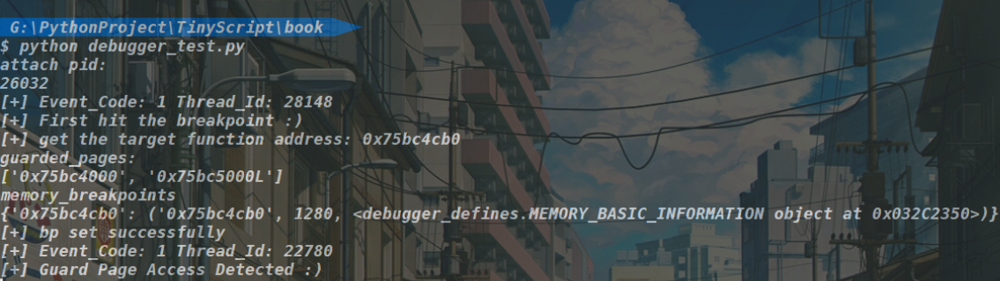

# Tiny Pydbg

> 花了一晚上学习一些Python语法，想写点小案例巩固下基础，参考Python灰帽子此书写一个轻量级的调试器，但发现全是坑，浪费一两天时间，不推荐学习:(，（PS：硬件断点的线程context修改失败，未解之谜），后续还是写IDA的插件

## Test_Results

- show regs

- software breakpoints

- hardware breakpoints

- memory breakpoints

